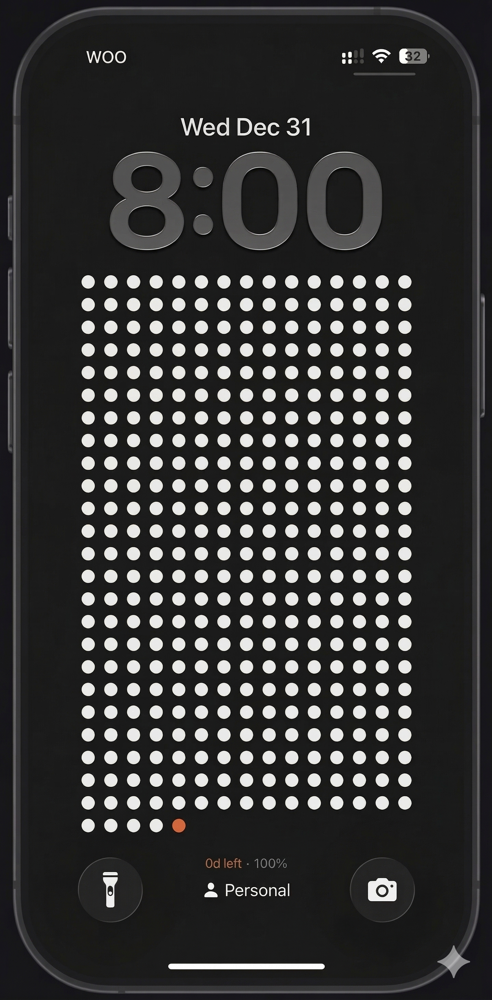
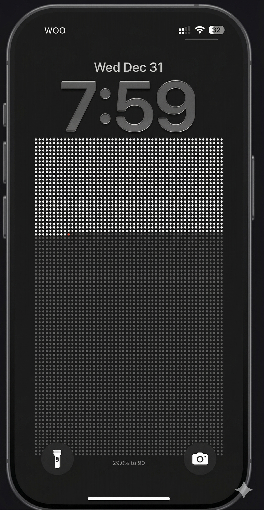
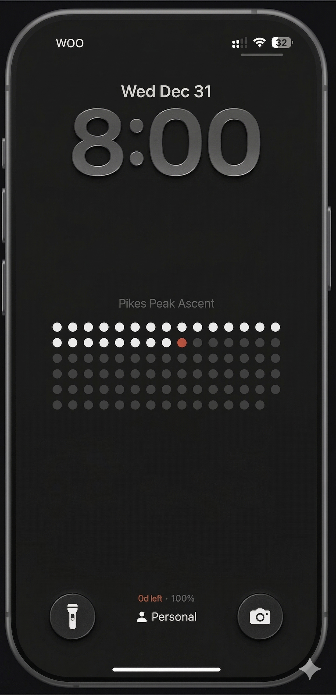

<p align="center">
  
</p>

<h1 align="center">DotDays</h1>

<p align="center">
  <strong>Life in Dots — Every dot is a day of your life.</strong>
</p>

<p align="center">
  
  
  
  
</p>

<p align="center">
  A beautifully minimal Android wallpaper app that visualizes your life as a grid of dots.<br/>
  Each dot represents a unit of time — days, weeks, or goal progress — turning your phone's wallpaper into a daily reminder of how you spend your time.
</p>

---

## 📸 Screenshots

<p align="center">
  
  &nbsp;&nbsp;&nbsp;
  
  &nbsp;&nbsp;&nbsp;
  
</p>

---

## ✨ Features

### 🗓️ Three Calendar Modes
- **Year View** — 365 dots representing each day of the current year
- **Life View** — Every week of your entire life (birth to expected lifespan) as a single dot
- **Goal View** — Track progress toward any custom goal with a countdown grid

### 🎨 Live Wallpaper
- Set the dot grid as your **home screen**, **lock screen**, or **both**
- Wallpaper updates **automatically every day** — no need to open the app
- Consistent rendering between preview and actual wallpaper

### ⚙️ Auto-Update Engine
- Background wallpaper updates via **WorkManager** (every 15 minutes, checks for day change)
- Survives **phone reboots** with a native `BootReceiver`
- Requests **battery optimization exemption** for reliable background execution
- Works on aggressive OEMs (Xiaomi, Realme, Samsung, OPPO)

### 🎯 Customization
- Choose your **lived dot color** (accent color for completed days)
- Pick your **date of birth** and **expected lifespan** for the Life view
- Set custom **goal names** with start and end dates

---

## 🏗️ Architecture

```
lib/
├── core/              # Theme, constants, design tokens
├── features/
│   ├── home/          # Main home screen
│   ├── onboarding/    # First-launch setup flow
│   ├── year/          # Year calendar configuration
│   ├── life/          # Life calendar configuration
│   ├── goal/          # Goal tracking configuration
│   ├── wallpaper/     # Wallpaper preview & application
│   └── settings/      # App settings screen
├── services/
│   ├── background_service.dart          # WorkManager scheduling
│   ├── headless_wallpaper_renderer.dart # Canvas-based wallpaper generation
│   ├── wallpaper_service.dart           # System wallpaper application
│   ├── wallpaper_auto_updater.dart      # App-launch fallback updater
│   ├── battery_optimization_service.dart # Battery exemption requests
│   └── storage_service.dart             # SharedPreferences wrapper
├── shared/            # Models, providers, shared widgets
├── routes/            # GoRouter navigation
└── main.dart          # App entry point
```

---

## 🛠️ Tech Stack

| Layer | Technology |
|-------|-----------|
| **Framework** | Flutter 3.5+ |
| **State Management** | Riverpod |
| **Navigation** | GoRouter |
| **Background Tasks** | WorkManager |
| **Storage** | SharedPreferences |
| **Wallpaper** | wallpaper_manager_flutter |
| **Rendering** | dart:ui Canvas API (headless) |

---

## 🚀 Getting Started

### Prerequisites
- Flutter SDK `^3.5.0`
- Android SDK
- An Android device or emulator

### Installation

```bash
# Clone the repository
git clone https://github.com/yourusername/DotDays.git
cd DotDays

# Install dependencies
flutter pub get

# Run the app
flutter run

# Build release APK
flutter build apk --split-per-abi
```

### Generate App Icon

```bash
dart run flutter_launcher_icons
```

The icon source file is at `assets/icons/icon.png`.

---

## 📱 How It Works

1. **Onboarding** — Choose your calendar type (Year/Life/Goal) and enter your details
2. **Preview** — See how the dot grid wallpaper will look on your phone
3. **Apply** — Set the wallpaper to your home screen, lock screen, or both
4. **Auto-Update** — The app registers a background task that regenerates the wallpaper daily with the updated dot count
5. **Boot Survival** — After phone restart, a native `BootReceiver` ensures the background task is re-registered

---

## 🔧 Background Task Reliability

DotDays uses multiple strategies to ensure the wallpaper updates reliably:

| Strategy | Purpose |
|----------|---------|
| **WorkManager** | Android-recommended background task scheduler |
| **BootReceiver** | Re-registers task after phone reboot |
| **Battery Optimization Exemption** | Prevents OS from killing the background task |
| **App-Launch Fallback** | Checks and updates wallpaper when app is opened |
| **Day-Change Guard** | Only regenerates wallpaper once per day |

---

## 📄 License

This project is licensed under the MIT License — see the [LICENSE](LICENSE) file for details.

---

<p align="center">
  Made with ❤️ and Flutter<br/>
  <strong>Every dot counts. Make them matter.</strong>
</p>
